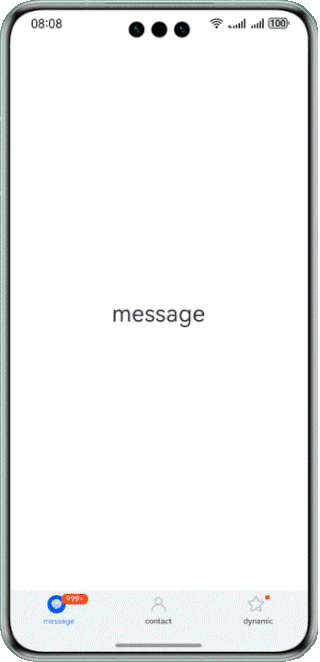
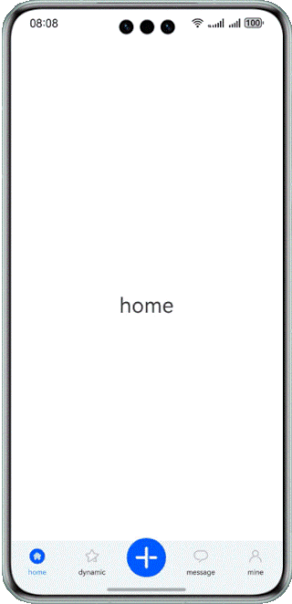
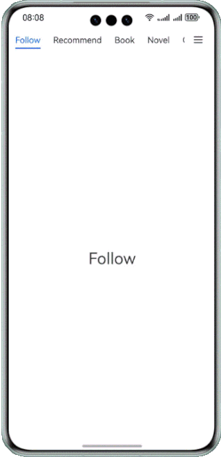
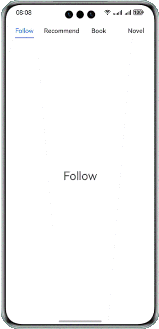
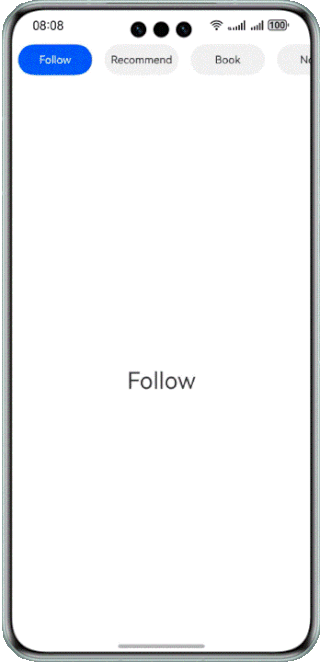
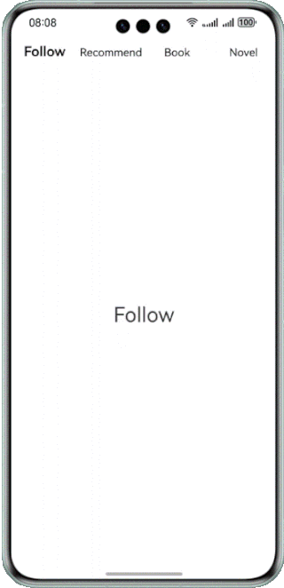
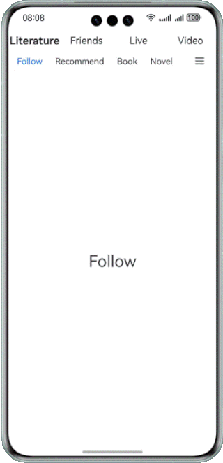
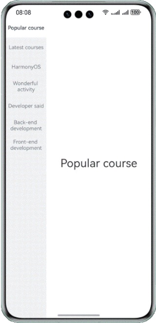
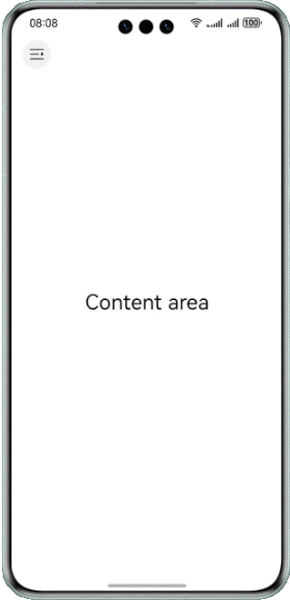
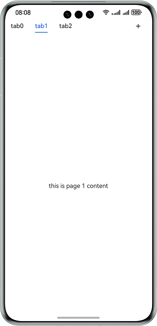

# Common Tab Navigation Styles

### Overview

This sample provides common tab navigation UI styles, including bottom navigation, top navigation, and side navigation.

### Preview
| Bottom navigation                             | Bottom rubber navigation                      | TabContent video sliding                       | Sliding + More button style                 |                         
|-----------------------------------------------|-----------------------------------------------|------------------------------------------------|---------------------------------------------|
|     |     |  |   |      
| Underline                                     | Background highlight                          | Text                                           | Double-layer nesting 1                      |
|  |  |     |  |
| Side navigation                        | Drawer-style side navigation                              | Left-aligned style navigation                  |
|   |       |     |

### How to Use
1. Tap a tab on the home page to go to the corresponding page.
2. Tap a tab on the navigation page to switch between pages.
3. Tap the icon in the upper left corner to expand or collapse the drawer navigation.

### Project Directory

```
├──entry/src/main/ets/
│  ├──common
│  │  └──Constants.ets                  // Common constants
│  │  ├──TabContentConstants.ets        // TabContentOverflow constant class
│  │  └──Utils                          // Common basic class library
│  ├──entryability
│  │  └──EntryAbility.ets               // Entry point class
│  ├──pages                 
│  │  ├──BackgroundLightTab.ets         // Background highlight
│  │  ├──BottomTab.ets                  // Bottom navigation
│  │  ├──DoubleNestingTabOne.ets        // Double-layer nesting implementation 1
│  │  ├──DoubleNestingTabTwo.ets        // Double-layer nesting implementation 2
│  │  ├──DrawerTab.ets                  // Drawer-style navigation
│  │  ├──Index.ets                      // Drawer-style side navigation
│  │  ├──LeftTab.ets                    // Left-aligned style navigation 
│  │  ├──RudderStyleTab.ets             // Bottom rudder navigation
│  │  ├──SideTab.ets                    // Side navigation
│  │  ├──SlideAndMoreTab.ets            // Slideable + More styles
│  │  ├──TabContentOverflow.ets         // TabContent video content sliding
│  │  ├──UnderlineTab.ets               // Underline
│  │  └──WordTab.ets                    // Text
│  ├──view                 
│  │  ├──Side.ets                       // Sidebar of TabContent video sliding
│  │  ├──TopView.ets                    // Topbar of TabContent video sliding
│  │  ├──VideoDes.ets                   // TabContent video content description
│  │  └──VideoTabContent.ets            // TabContent video content
│  │  └──DiscoverPage.ets               // DoubleNesting content
│  └──viewmodel                  
│     ├──TabItem.ets                    // Navigation class
│     └──TabViewModel.ets               // Navigation data
└──entry/src/main/resources             // Static resources of the app
```

### How to Implement

1. The common bottom navigation is implemented by the **Tab** component.
2. Two-layer nesting style: The first layer uses the **Tab** component, and the second layer uses the **List** component.
3. Slidable + More: This navigation style is implemented using the **List** component on the left. More icons are displayed on the right. You can set the **margin** value for the underline and modify the value through the **onAreaChange** method to move the slider. The **scrollToIndex** method is used to display and center the tab bar during switching.
4. The background highlight style and common sidebar navigation are implemented using the **List** component.
5. The drawer-style navigation is implemented by using **SideBarContainer**.
6. TabContent video sliding: Create a **Tabs** component and set **barHeight** to **0**. Create a customized tab bar. Divide the content of TabContent into two parts: the upper part stores the **video** component and the lower part stores the progress bar. Set the sliding gesture response event. Set the **zIndex** attribute of the **Tabs** component to **2** so that the TabContent view displayed over the customized tab bar. Then set the **hitTestBehavior** attribute to enable the covered customized tab bar to respond to a tap event.

### Required Permissions
N/A

### Dependencies
N/A

### Constraints

1. The sample is supported on Huawei phones, tablets and PC/2in1 with standard systems.

2. The HarmonyOS version must be HarmonyOS 5.0.5 Release or later.

3. The DevEco Studio version must be DevEco Studio 5.0.5 Release or later.

4. The HarmonyOS SDK version must be HarmonyOS 5.0.5 Release or later.
