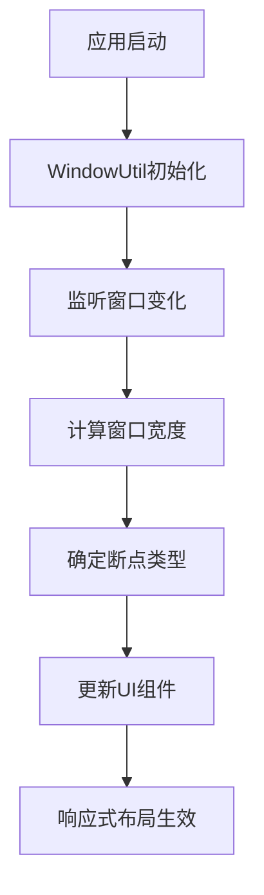

# HarmonyOS 响应式布局完整教程

## 什么是响应式布局

响应式布局是指应用界面能够根据不同设备的屏幕尺寸（手机、平板、折叠屏等）自动适配显示的技术。

### 为什么需要响应式布局？

在 HarmonyOS 生态中，我们面临多种设备形态：
- **手机**：3.2-6.9 英寸，竖屏为主
- **折叠屏**：6.9-8.5 英寸，可折叠变形
- **平板**：8.5-12.9 英寸，横屏体验更佳
- **PC/车机**：更大屏幕，需要充分利用空间

同一个应用在不同设备上应该提供最佳的用户体验。

## 项目概览

这个响应式布局示例项目展示了 HarmonyOS 中 10 种常见的响应式布局模式：

### 支持的布局类型

| 布局类型 | 应用场景 | 核心组件 |
|---------|---------|----------|
| **列表布局** | 信息流、设置页面 | `List` |
| **瀑布流布局** | 图片展示、商品列表 | `WaterFlow` |
| **轮播布局** | 广告展示、图片浏览 | `Swiper` |
| **网格布局** | 应用图标、功能入口 | `Grid` |
| **侧边栏布局** | 导航菜单、工具面板 | `SideBarContainer` |
| **单双栏布局** | 邮件应用、文件管理 | `Navigation` |
| **三分栏布局** | 复杂应用、多级导航 | `SideBarContainer` + `Navigation` |
| **挪移布局** | 内容重排、卡片布局 | `GridRow/GridCol` |
| **导航布局** | 底部标签、侧边导航 | `Tabs` |
| **缩进布局** | 内容居中、边距调整 | `GridRow/GridCol` |

### 设备适配规则

- **手机** (小屏)：单列显示，简洁布局
- **折叠屏** (中屏)：双列显示，平衡布局
- **平板** (大屏)：多列显示，充分利用空间

## 核心概念

### 1. 断点系统 (WidthBreakpoint)

HarmonyOS 使用断点来判断设备类型：

```typescript
enum WidthBreakpoint {
  WIDTH_XS,  // 超小屏：0-319dp
  WIDTH_SM,  // 小屏：320-599dp (手机竖屏)
  WIDTH_MD,  // 中屏：600-839dp (折叠屏/平板竖屏)
  WIDTH_LG   // 大屏：840dp+ (平板横屏)
}
```

### 2. 响应式工具类

**WidthBreakpointType** 是核心工具类，用于根据断点返回不同的值：

```typescript
export class WidthBreakpointType<T> {
  sm: T;  // 小屏值
  md: T;  // 中屏值
  lg: T;  // 大屏值

  constructor(sm: T, md: T, lg: T) {
    this.sm = sm;
    this.md = md;
    this.lg = lg;
  }

  getValue(widthBp: WidthBreakpoint): T {
    if (widthBp === WidthBreakpoint.WIDTH_XS || widthBp === WidthBreakpoint.WIDTH_SM) {
      return this.sm;  // 小屏返回sm值
    }
    if (widthBp === WidthBreakpoint.WIDTH_MD) {
      return this.md;  // 中屏返回md值
    } else {
      return this.lg;  // 大屏返回lg值
    }
  }
}
```

---

## 项目结构详解

### 项目结构

```
ResponsiveLayout/
├── entry/src/main/ets/
│   ├── pages/                          # 页面文件
│   │   ├── Index.ets                   # 主页面 - 展示所有布局选项
│   │   ├── ListLayout.ets              # 列表布局页面
│   │   ├── WaterFlowLayout.ets         # 瀑布流布局页面
│   │   ├── SwiperLayout.ets            # 轮播布局页面
│   │   ├── GridLayout.ets              # 网格布局页面
│   │   ├── SidebarLayout.ets           # 侧边栏布局页面
│   │   ├── DoubleColumnLayout.ets      # 单双栏布局页面
│   │   ├── TripleColumnLayout.ets      # 三分栏布局页面
│   │   ├── MoveLayout.ets              # 挪移布局页面
│   │   ├── TabsLayout.ets              # 导航布局页面
│   │   └── IndentedLayout.ets          # 缩进布局页面
│   ├── views/             							 # 视图组件
│   │   ├── ListView.ets                # 列表视图组件
│   │   ├── WaterFlowView.ets           # 瀑布流视图组件
│   │   ├── SwiperView.ets              # 轮播视图组件
│   │   ├── GridView.ets                # 网格视图组件
│   │   ├── SidebarView.ets             # 侧边栏视图组件
│   │   ├── DoubleColumnView.ets        # 单双栏视图组件
│   │   ├── TripleColumnView.ets        # 三分栏视图组件
│   │   ├── MoveView.ets                # 挪移视图组件
│   │   ├── TabsView.ets                # 导航视图组件
│   │   ├── IndentedView.ets            # 缩进视图组件
│   │   ├── NavigationBarView.ets       # 导航栏组件
│   │   └── NavigationContentView.ets   # 内容区组件
│   └── utils/             							 # 工具类
│       ├── WidthBreakpointType.ets     # 断点响应式工具类
│       └── WindowUtil.ets              # 窗口工具类
```

### 架构设计说明

**页面 → 视图** 的分层设计：
- **Pages**：负责页面路由和生命周期管理
- **Views**：负责具体的UI实现和响应式逻辑
- **Utils**：提供断点判断和窗口信息

## 十种响应式布局详解

### 1. 列表布局 (List Layout)

**适用场景**：信息流、设置页面、聊天记录、新闻列表等
**核心特点**：根据屏幕大小动态调整列数和间距

#### 实现原理

列表布局通过 `List` 组件的 `lanes` 属性实现多列显示：

```typescript
List()
  .lanes(new WidthBreakpointType(1, 2, 3).getValue(this.mainWindowInfo.widthBp))
  .space(new WidthBreakpointType(8, 12, 16).getValue(this.mainWindowInfo.widthBp))
```

**详细解析**：
- **小屏（手机）**：1列显示，8dp间距 - 适合单手操作
- **中屏（折叠屏）**：2列显示，12dp间距 - 提高空间利用率
- **大屏（平板）**：3列显示，16dp间距 - 充分利用大屏优势

### 2. 瀑布流布局 (WaterFlow Layout)

**适用场景**：图片展示、商品列表、Pinterest式内容展示
**核心特点**：等宽不等高的网格布局，自动调整高度

#### 实现原理

```typescript
WaterFlow() {
  LazyForEach(this.dataSource, (item: number, index: number) => {
    FlowItem() {
      // 内容区域
    }
    .width('100%')
    .height(this.itemHeightArray[index])  // 动态高度
  })
}
.columnsTemplate(`repeat(${new WidthBreakpointType(2, 3, 4).getValue(this.mainWindowInfo.widthBp)}, 1fr)`)
```

**关键技术点**：
- **动态高度**：`this.itemHeightArray[index]` 为每个项目设置不同高度
- **响应式列数**：小屏2列，中屏3列，大屏4列
- **自动流式布局**：WaterFlow组件自动计算最佳放置位置

**适配策略**：
- **手机**：2列 - 保证内容可读性
- **折叠屏**：3列 - 平衡内容与空间
- **平板**：4列 - 最大化空间利用

### 3. 网格布局 (Grid Layout)

**适用场景**：应用图标、功能入口、产品展示、仪表盘
**核心特点**：规整的矩形网格，固定宽高比

#### 实现原理

```typescript
Grid() {
  ForEach(this.infoArray, (item: number) => {
    GridItem() {
      // 网格项内容
    }
    .aspectRatio(1.8)  // 固定宽高比
  })
}
.columnsTemplate(`repeat(${new WidthBreakpointType(2, 3, 4).getValue(this.mainWindowInfo.widthBp)}, 1fr)`)
```

**技术细节**：
- **固定比例**：`.aspectRatio(1.8)` 确保所有网格项保持一致的外观
- **响应式列数**：根据屏幕大小调整列数
- **等宽布局**：`1fr` 确保每列等宽

**应用示例**：
- **手机**：2x4网格 - 适合拇指操作
- **折叠屏**：3x3网格 - 平衡显示
- **平板**：4x2网格 - 横向充分利用

### 4. 侧边栏布局 (Sidebar Layout)

**适用场景**：导航菜单、工具面板、设置面板、多级导航
**核心特点**：可折叠的侧边导航，根据屏幕大小切换显示模式

#### 实现原理

```typescript
SideBarContainer(
  this.mainWindowInfo.widthBp === WidthBreakpoint.WIDTH_SM ?
  SideBarContainerType.Overlay :  // 小屏：覆盖模式
  SideBarContainerType.Embed     // 大屏：嵌入模式
) {
  // 侧边栏内容
} {
  // 主内容区
}
.sideBarWidth(new WidthBreakpointType('80%', '50%', '40%').getValue(this.mainWindowInfo.widthBp))
```

**模式切换逻辑**：
- **小屏（手机）**：
  - 模式：`Overlay`（覆盖）
  - 宽度：80% - 保留主界面可见性
  - 行为：抽屉式，可手势滑出

- **中屏（折叠屏）**：
  - 模式：`Embed`（嵌入）
  - 宽度：50% - 平衡侧栏与主内容
  - 行为：固定显示，可折叠

- **大屏（平板）**：
  - 模式：`Embed`（嵌入）
  - 宽度：40% - 充分利用屏幕空间
  - 行为：永久显示，提高效率

### 5. 单双栏布局 (Double Column Layout)

**适用场景**：邮件应用、文件管理器、主从页面
**核心特点**：左侧列表+右侧详情的经典布局

#### 实现原理

使用 `Navigation` 组件的模式切换：

```typescript
Navigation()
  .mode(this.mainWindowInfo.widthBp === WidthBreakpoint.WIDTH_SM ?
        NavigationMode.Stack :    // 小屏：堆栈模式
        NavigationMode.Split)     // 大屏：分栏模式
```

**模式说明**：
- **Stack模式（手机）**：
  - 页面堆栈导航
  - 一次只显示一个页面
  - 通过返回按钮切换页面

- **Split模式（平板）**：
  - 左右分栏显示
  - 左侧：导航列表
  - 右侧：详情内容
  - 同时显示多级信息

### 6. 三分栏布局 (Triple Column Layout)

**适用场景**：复杂应用、多级导航、企业应用
**核心特点**：导航栏+列表+详情的三层结构

#### 实现原理

组合使用 `SideBarContainer` + `Navigation`：

```typescript
SideBarContainer() {
  // 第一栏：导航菜单
} {
  Navigation() {
    // 第二栏+第三栏：列表+详情
  }
  .mode(NavigationMode.Split)
}
```

**布局逻辑**：
- **小屏**：单栏显示，页面堆栈导航
- **中屏**：双栏显示，隐藏导航栏
- **大屏**：三栏同时显示，最大化效率

### 7. 轮播布局 (Swiper Layout)

**适用场景**：广告展示、图片浏览、引导页、内容推荐
**核心特点**：响应式轮播，适配不同屏幕

#### 实现原理

```typescript
Swiper() {
  ForEach(this.swiperList, (item: string) => {
    // 轮播项内容
  })
}
.itemSpace(new WidthBreakpointType(0, 10, 20).getValue(this.mainWindowInfo.widthBp))
.displayCount(new WidthBreakpointType(1, 2, 3).getValue(this.mainWindowInfo.widthBp))
```

**响应式特性**：
- **显示数量**：根据屏幕大小调整同时显示的项目数
- **项目间距**：动态调整轮播项之间的间距
- **滑动行为**：保持一致的滑动体验

### 8. 挪移布局 (Move Layout)

**适用场景**：内容重排、卡片布局、流式布局
**核心特点**：根据屏幕大小重新排列组件位置

#### 实现原理

使用 `GridRow` 和 `GridCol` 实现栅格布局：

```typescript
GridRow() {
  GridCol({
    span: new WidthBreakpointType(12, 6, 4).getValue(this.mainWindowInfo.widthBp)
  }) {
    // 内容区域
  }
}
```

**栅格规则**：
- **总列数**：12列栅格系统
- **小屏**：12/12 = 100%宽度（全屏显示）
- **中屏**：6/12 = 50%宽度（两列显示）
- **大屏**：4/12 = 33.3%宽度（三列显示）

### 9. 导航布局 (Tabs Layout)

**适用场景**：底部导航、顶部标签、分类切换
**核心特点**：底部/侧边导航的自适应切换

#### 实现原理

```typescript
Tabs({
  barPosition: this.mainWindowInfo.widthBp === WidthBreakpoint.WIDTH_SM ?
               BarPosition.End :    // 小屏：底部导航
               BarPosition.Start    // 大屏：侧边导航
}) {
  // 标签页内容
}
```

**导航位置策略**：
- **手机**：底部导航 - 符合单手操作习惯
- **平板**：侧边导航 - 充分利用横向空间

### 10. 缩进布局 (Indented Layout)

**适用场景**：内容居中、边距调整、阅读模式
**核心特点**：根据屏幕大小调整内容边距

#### 实现原理

使用 `GridRow` 的偏移和跨度：

```typescript
GridRow() {
  GridCol({
    span: new WidthBreakpointType(12, 10, 8).getValue(this.mainWindowInfo.widthBp),
    offset: new WidthBreakpointType(0, 1, 2).getValue(this.mainWindowInfo.widthBp)
  }) {
    // 内容区域
  }
}
```

**缩进策略**：
- **小屏**：跨度12，偏移0 - 全屏显示
- **中屏**：跨度10，偏移1 - 左右各留1列边距
- **大屏**：跨度8，偏移2 - 左右各留2列边距，突出内容

## 核心代码解析

### 主页面 (Index.ets)

主页面展示了所有响应式布局的入口：

```typescript
@Entry
@Component
struct Index {
  @StorageLink('windowUtil') windowUtil: WindowUtil | undefined = undefined;
  @Provide('pageInfos') pageInfos: NavPathStack = new NavPathStack();

  build() {
    Navigation(this.pageInfos) {
      Scroll() {
        Column() {
          // 标题区域
          Column() {
            Text($r('app.string.sample_name'))
              .fontSize(30)
              .fontWeight(700)
              .lineHeight(40)
          }
          .height(112)
          .width('100%')
          .alignItems(HorizontalAlign.Start)
          .justifyContent(FlexAlign.End)
          .margin({ bottom: 12 })

          // 布局选项列表
          ListJumpView({
            mainWindowInfo: this.windowUtil?.mainWindowInfo
          })
        }
        .width('100%')
        .padding({
          top: this.getUIContext().px2vp(this.windowUtil?.mainWindowInfo.AvoidSystem?.topRect.height),
          left: 16,
          right: 16
        })
      }
    }
    .height('100%')
    .width('100%')
    .mode(NavigationMode.Stack)
    .hideBackButton(true)
    .hideToolBar(true)
  }
}
```

### 响应式列表组件 (ListJumpView)

这个组件展示了如何使用断点来控制列表的列数：

```typescript
@Component
struct ListJumpView {
  @Consume('pageInfos') pageInfos: NavPathStack;
  @ObjectLink mainWindowInfo: WindowInfo;

  // 布局选项数据
  layoutInfos: Resource[] = [
    $r('app.string.list'),
    $r('app.string.water_flow'),
    $r('app.string.swiper'),
    $r('app.string.grid'),
    $r('app.string.sidebar'),
    $r('app.string.double_column'),
    $r('app.string.triple_column'),
    $r('app.string.move_layout'),
    $r('app.string.tabs'),
    $r('app.string.indented_layout')
  ];

  build() {
    List() {
      ForEach(this.layoutInfos, (item: Resource, index: number) => {
        ListItem() {
          Row() {
            Text(item)
              .fontSize(16)
            Blank()
            Image($r('app.media.chevron_right'))
              .width(12)
              .height(24)
              .opacity(0.4)
          }
          .height('100%')
          .width('100%')
          .padding({ left: 12, right: 12 })
          .onClick(() => {
            // 点击跳转到对应页面
            this.pageInfos.pushPathByName(this.urlInfos[index], null);
          })
        }
        .height(48)
      })
    }
    .width('100%')
    // 🔥 核心：根据断点设置不同的列数
    .lanes(new WidthBreakpointType(1, 2, 2).getValue(this.mainWindowInfo.widthBp))
    .borderRadius(16)
    .backgroundColor(Color.White)
  }
}
```

**解释**：
- `WidthBreakpointType(1, 2, 2)` 表示：
  - 小屏（手机）：1列
  - 中屏（折叠屏）：2列
  - 大屏（平板）：2列

### 列表布局视图 (ListView.ets)

展示了列表组件的响应式实现：

```typescript
@Component
export struct ListView {
  @ObjectLink mainWindowInfo: WindowInfo;
  pageInfos: NavPathStack = new NavPathStack();
  infoArray: number[] = [0, 1, 2, 3, 4, 5, 6, 7, 8, 9, 10, 11];
  listScroller: ListScroller = new ListScroller();

  build() {
    Column() {
      // 返回按钮和标题
      Row() {
        Image($r('app.media.ic_public_back'))
          .width(40)
          .height(40)
          .margin({ right: 12 })
          .onClick(() => {
            this.pageInfos.pop();
          })
        Text($r('app.string.list'))
          .fontSize(24)
      }

      // 🔥 核心：响应式列表
      List({
        // 根据断点设置不同的间距
        space: new WidthBreakpointType(8, 12, 16).getValue(this.mainWindowInfo.widthBp),
        scroller: this.listScroller
      }) {
        ForEach(this.infoArray, (item: number, index: number) => {
          ListItem() {
            Row() {}
            .width('100%')
            .height(60)
            .borderRadius(16)
            .backgroundColor('#F1F3F5')
          }
        })
      }
      .scrollBar(BarState.Off)
      // 🔥 核心：根据断点设置不同的列数
      .lanes(new WidthBreakpointType(1, 2, 3).getValue(this.mainWindowInfo.widthBp), 12)
      .layoutWeight(this.mainWindowInfo.widthBp === WidthBreakpoint.WIDTH_SM ? 1 : -1)
      .width('100%')
    }
  }
}
```

**关键点解析**：

1. **间距响应式**：`new WidthBreakpointType(8, 12, 16)`
   - 小屏：8dp 间距
   - 中屏：12dp 间距
   - 大屏：16dp 间距

2. **列数响应式**：`new WidthBreakpointType(1, 2, 3)`
   - 小屏：1列（手机竖屏）
   - 中屏：2列（折叠屏）
   - 大屏：3列（平板）

---

## 实现原理

### 断点检测流程



### 响应式组件工作原理

```typescript
// 伪代码演示工作流程
class ResponsiveComponent {
  @ObjectLink mainWindowInfo: WindowInfo;

  build() {
    List() {
      // ...列表项
    }
    // 根据当前窗口断点，返回对应的列数
    .lanes(this.calculateLanes(this.mainWindowInfo.widthBp))
  }

  private calculateLanes(widthBp: WidthBreakpoint): number {
    // 使用工具类获取响应式值
    return new WidthBreakpointType(1, 2, 3).getValue(widthBp);
  }
}
```

### 设备适配策略

| 设备类型 | 屏幕断点 | 布局策略 | 典型场景 |
|---------|---------|---------|----------|
| **手机** | WIDTH_SM | 单列，紧凑布局 | 信息流滚动浏览 |
| **折叠屏** | WIDTH_MD | 双列，平衡布局 | 多任务并行操作 |
| **平板** | WIDTH_LG | 多列，充分利用 | 内容创作，办公 |

## 实现教程

### 步骤 1：创建断点工具类

```typescript
// utils/WidthBreakpointType.ets
export class WidthBreakpointType<T> {
  sm: T;   // 小屏幕值
  md: T;   // 中屏幕值
  lg: T;   // 大屏幕值

  constructor(sm: T, md: T, lg: T) {
    this.sm = sm;
    this.md = md;
    this.lg = lg;
  }

  getValue(widthBp: WidthBreakpoint): T {
    // 根据断点返回对应值
    if (widthBp === WidthBreakpoint.WIDTH_XS ||
        widthBp === WidthBreakpoint.WIDTH_SM) {
      return this.sm;  // 小屏
    }
    if (widthBp === WidthBreakpoint.WIDTH_MD) {
      return this.md;  // 中屏
    } else {
      return this.lg;  // 大屏
    }
  }
}
```

### 步骤 2：创建简单的响应式列表

```typescript
// views/SimpleResponsiveList.ets
import { WidthBreakpointType } from '../utils/WidthBreakpointType';

@Component
export struct SimpleResponsiveList {
  @ObjectLink mainWindowInfo: WindowInfo;

  // 模拟数据
  private dataList: string[] = ['项目1', '项目2', '项目3', '项目4', '项目5', '项目6'];

  build() {
    List() {
      ForEach(this.dataList, (item: string, index: number) => {
        ListItem() {
          Text(item)
            .width('100%')
            .height(80)
            .textAlign(TextAlign.Center)
            .backgroundColor('#E8F4FF')
            .borderRadius(8)
        }
      })
    }
    .width('100%')
    .height('100%')
    // 🔥 响应式核心：根据屏幕大小设置列数
    .lanes(new WidthBreakpointType(1, 2, 3).getValue(this.mainWindowInfo.widthBp))
    // 🔥 响应式间距
    .space(new WidthBreakpointType(8, 12, 16).getValue(this.mainWindowInfo.widthBp))
    .padding(16)
  }
}
```

### 步骤 3：在页面中使用

```typescript
// pages/ResponsiveListPage.ets
import { SimpleResponsiveList } from '../views/SimpleResponsiveList';

@Entry
@Component
struct ResponsiveListPage {
  @StorageLink('windowUtil') windowUtil: WindowUtil | undefined = undefined;

  build() {
    Column() {
      Text('响应式列表示例')
        .fontSize(24)
        .fontWeight(FontWeight.Bold)
        .margin({ bottom: 16 })

      // 使用响应式列表组件
      SimpleResponsiveList({
        mainWindowInfo: this.windowUtil?.mainWindowInfo
      })
    }
    .width('100%')
    .height('100%')
    .padding(16)
  }
}
```

### 步骤 4：测试响应式效果

1. **在手机上运行**：应该看到单列布局
2. **在平板上运行**：应该看到三列布局
3. **改变设备方向**：布局应该自动适配

---

## 高级响应式技巧

### 组合多个响应式属性

```typescript
@Component
struct AdvancedResponsiveCard {
  @ObjectLink mainWindowInfo: WindowInfo;

  build() {
    Row() {
      // 内容区域
    }
    .width('100%')
    // 🔥 响应式高度
    .height(new WidthBreakpointType(120, 160, 200).getValue(this.mainWindowInfo.widthBp))
    // 🔥 响应式内边距
    .padding(new WidthBreakpointType(12, 16, 24).getValue(this.mainWindowInfo.widthBp))
    // 🔥 响应式圆角
    .borderRadius(new WidthBreakpointType(8, 12, 16).getValue(this.mainWindowInfo.widthBp))
    // 🔥 响应式边距
    .margin(new WidthBreakpointType(8, 12, 16).getValue(this.mainWindowInfo.widthBp))
  }
}
```

### 条件响应式布局

```typescript
@Component
struct ConditionalResponsiveLayout {
  @ObjectLink mainWindowInfo: WindowInfo;

  build() {
    if (this.mainWindowInfo.widthBp === WidthBreakpoint.WIDTH_SM) {
      // 小屏：垂直布局
      Column() {
        this.HeaderContent()
        this.MainContent()
        this.FooterContent()
      }
    } else {
      // 大屏：水平布局
      Row() {
        Column() {
          this.HeaderContent()
          this.FooterContent()
        }
        .width('30%')

        this.MainContent()
          .layoutWeight(1)
      }
    }
  }

  @Builder HeaderContent() {
    Text('头部内容').fontSize(18)
  }

  @Builder MainContent() {
    Text('主要内容').fontSize(16)
  }

  @Builder FooterContent() {
    Text('底部内容').fontSize(14)
  }
}
```

### 响应式网格布局

```typescript
@Component
struct ResponsiveGrid {
  @ObjectLink mainWindowInfo: WindowInfo;
  private gridData: string[] = Array.from({length: 20}, (_, i) => `项目${i + 1}`);

  build() {
    Grid() {
      ForEach(this.gridData, (item: string) => {
        GridItem() {
          Text(item)
            .width('100%')
            .height(80)
            .backgroundColor('#FFE4E1')
            .textAlign(TextAlign.Center)
            .borderRadius(8)
        }
      })
    }
    .width('100%')
    .height('100%')
    // 🔥 响应式列数
    .columnsTemplate(this.getColumnsTemplate())
    // 🔥 响应式间距
    .columnsGap(new WidthBreakpointType(8, 12, 16).getValue(this.mainWindowInfo.widthBp))
    .rowsGap(new WidthBreakpointType(8, 12, 16).getValue(this.mainWindowInfo.widthBp))
    .padding(16)
  }

  private getColumnsTemplate(): string {
    const columns = new WidthBreakpointType(2, 3, 4).getValue(this.mainWindowInfo.widthBp);
    return new Array(columns).fill('1fr').join(' ');
  }
}
```

---

## 最佳实践

### 性能优化

```typescript
// ✅ 推荐：缓存响应式值
@Component
struct OptimizedResponsiveComponent {
  @ObjectLink mainWindowInfo: WindowInfo;

  // 缓存计算结果，避免重复计算
  private get lanes(): number {
    return new WidthBreakpointType(1, 2, 3).getValue(this.mainWindowInfo.widthBp);
  }

  private get spacing(): number {
    return new WidthBreakpointType(8, 12, 16).getValue(this.mainWindowInfo.widthBp);
  }

  build() {
    List() {
      // 列表项...
    }
    .lanes(this.lanes)
    .space(this.spacing)
  }
}
```

### 语义化断点值

```typescript
// ✅ 推荐：使用有意义的常量
class ResponsiveConstants {
  // 列数配置
  static readonly LIST_LANES = new WidthBreakpointType(1, 2, 3);
  static readonly GRID_LANES = new WidthBreakpointType(2, 3, 4);

  // 间距配置
  static readonly SMALL_SPACING = new WidthBreakpointType(8, 12, 16);
  static readonly LARGE_SPACING = new WidthBreakpointType(16, 20, 24);

  // 字体大小配置
  static readonly TITLE_FONT_SIZE = new WidthBreakpointType(20, 24, 28);
  static readonly BODY_FONT_SIZE = new WidthBreakpointType(14, 16, 18);
}

// 使用方式
.lanes(ResponsiveConstants.LIST_LANES.getValue(this.mainWindowInfo.widthBp))
.space(ResponsiveConstants.SMALL_SPACING.getValue(this.mainWindowInfo.widthBp))
```

### 3. 组件复用策略

```typescript
// 创建可复用的响应式组件
@Component
export struct ResponsiveCard {
  @ObjectLink mainWindowInfo: WindowInfo;
  title: string = '';
  content: string = '';

  build() {
    Column() {
      Text(this.title)
        .fontSize(ResponsiveConstants.TITLE_FONT_SIZE.getValue(this.mainWindowInfo.widthBp))
        .fontWeight(FontWeight.Bold)
        .margin({ bottom: 8 })

      Text(this.content)
        .fontSize(ResponsiveConstants.BODY_FONT_SIZE.getValue(this.mainWindowInfo.widthBp))
        .opacity(0.8)
    }
    .width('100%')
    .padding(ResponsiveConstants.LARGE_SPACING.getValue(this.mainWindowInfo.widthBp))
    .backgroundColor(Color.White)
    .borderRadius(8)
    .shadow({ radius: 4, color: '#1F000000' })
  }
}
```

---

## 常见问题

### Q1: 为什么响应式布局不生效？

**A1:** 检查以下几点：
1. 是否正确初始化了 `WindowUtil`
2. 是否在组件中正确获取了 `mainWindowInfo`
3. 是否使用了 `@ObjectLink` 装饰器

```typescript
// ❌ 错误示例
@Component
struct BadExample {
  mainWindowInfo: WindowInfo; // 缺少 @ObjectLink

  build() {
    List().lanes(2) // 硬编码，不响应式
  }
}

// ✅ 正确示例
@Component
struct GoodExample {
  @ObjectLink mainWindowInfo: WindowInfo; // 正确装饰器

  build() {
    List()
      .lanes(new WidthBreakpointType(1, 2, 3).getValue(this.mainWindowInfo.widthBp))
  }
}
```

### Q2: 如何测试不同断点的效果？

**A2:** 有几种方法：
1. **改变窗口大小**：在模拟器中拖拽改变窗口大小
2. **切换设备**：在 DevEco Studio 中切换不同设备预览
3. **代码调试**：添加日志输出当前断点

```typescript
build() {
  console.log('当前断点:', this.mainWindowInfo.widthBp);
  // 其余代码...
}
```

### Q3: 响应式组件性能如何优化？

**A3:** 优化建议：
1. **缓存计算结果**：避免重复调用 `getValue()`
2. **减少嵌套**：避免过深的组件嵌套
3. **懒加载**：大列表使用懒加载机制

```typescript
// ✅ 性能优化示例
@Component
struct OptimizedComponent {
  @ObjectLink mainWindowInfo: WindowInfo;

  // 缓存响应式值
  @Computed
  get responsiveConfig() {
    return {
      lanes: new WidthBreakpointType(1, 2, 3).getValue(this.mainWindowInfo.widthBp),
      spacing: new WidthBreakpointType(8, 12, 16).getValue(this.mainWindowInfo.widthBp),
      fontSize: new WidthBreakpointType(14, 16, 18).getValue(this.mainWindowInfo.widthBp)
    };
  }

  build() {
    List()
      .lanes(this.responsiveConfig.lanes)
      .space(this.responsiveConfig.spacing)
  }
}
```

### Q4: 如何处理特殊设备（如车机、TV）？

**A4:** 扩展断点系统：

```typescript
// 扩展更多设备类型
export class ExtendedBreakpointType<T> {
  phone: T;    // 手机
  tablet: T;   // 平板
  desktop: T;  // PC
  tv: T;       // 电视
  car: T;      // 车机

  getValue(deviceType: string, widthBp: WidthBreakpoint): T {
    // 根据设备类型和断点返回值
    switch(deviceType) {
      case 'tv': return this.tv;
      case 'car': return this.car;
      default:
        // 使用原有逻辑
        return widthBp <= WidthBreakpoint.WIDTH_SM ? this.phone :
               widthBp === WidthBreakpoint.WIDTH_MD ? this.tablet : this.desktop;
    }
  }
}
```

## 总结

HarmonyOS 响应式布局的核心是：

1. **断点系统**：根据屏幕宽度自动判断设备类型
2. **响应式工具类**：`WidthBreakpointType` 提供统一的响应式值管理
3. **组件适配**：各个UI组件支持响应式属性配置
4. **最佳实践**：缓存计算、语义化配置、组件复用

掌握这些概念和技巧，你就能够创建出在各种 HarmonyOS 设备上都能提供良好用户体验的应用了。

### 下一步学习建议

1. **实践项目**：基于本教程创建自己的响应式应用
2. **深入学习**：研究项目中的其他布局类型（瀑布流、网格等）
3. **性能优化**：学习如何优化响应式组件的性能
4. **设计规范**：了解 HarmonyOS 的设计规范和最佳实践

